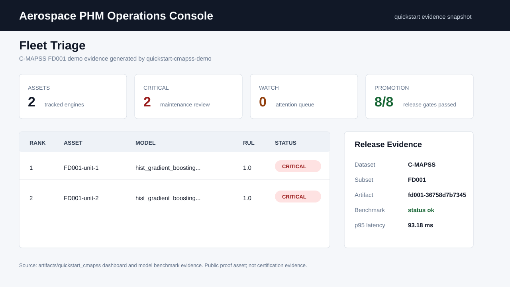

# Aerospace Prognostics

Aerospace Prognostics is a production-grade PHM engineering project for fleet
health operations, model evidence, and deployment-ready inference. It combines
turbofan Remaining Useful Life prediction, spacecraft telemetry anomaly
detection, release evidence, a FastAPI serving surface, and an operator console.

The goal is not a notebook demo. The project is being shaped into a useful
operations tool and engineering reference for aerospace Prognostics & Health
Management workflows.

## What It Does

- Builds C-MAPSS turbofan RUL baselines, sequence models, diagnostics, and
  calibrated prediction artifacts.
- Builds SMAP/MSL spacecraft telemetry anomaly baselines and comparison reports.
- Packages a deployable model artifact with validation, benchmark, model-card,
  SBOM, release-bundle, and provenance evidence.
- Serves predictions through FastAPI with health, readiness, schema discovery,
  API-key protection, metrics, and drift summaries.
- Provides a Streamlit operations console for fleet triage, model registry,
  batch prediction, prediction history, outcome imports, operator decisions, and
  downloadable review evidence.
- Supports Docker Compose for a local API plus console product stack, and a
  read-only hosted-demo image path with baked-in quickstart evidence.

## Visual Proof



The tracked public proof set includes this console snapshot and a quickstart RUL
diagnostic plot in [docs/public_proof_assets.md](docs/public_proof_assets.md).
They summarize the no-download quickstart evidence while the repository remains
private.

## Run This First

The no-download quickstart uses tiny fixture data to generate a complete local
evidence bundle and app database:

```powershell
uv sync --dev
uv run aerospace-prognostics quickstart-cmapss-demo
uv run aerospace-prognostics app-init-db
uv run streamlit run src/aerospace_prognostics/app/streamlit_app.py
```

The commands create dashboard, release, provenance, artifact-inspection,
model-card, validation, benchmark, and SBOM artifacts under
`artifacts/quickstart_cmapss`, then seed SQLite app state under `artifacts/app`.
See [docs/quickstart.md](docs/quickstart.md).

## Local Product Stack

To run the console and API together:

```powershell
uv run aerospace-prognostics quickstart-cmapss-demo
docker compose up --build
```

Open the console at `http://127.0.0.1:8501`, or check API readiness at
`http://127.0.0.1:8000/ready`. See
[docs/local_deployment.md](docs/local_deployment.md).

For a self-contained read-only console image:

```bash
docker build -f Dockerfile.demo -t aerospace-prognostics-demo:local .
docker run --rm --read-only --tmpfs /tmp:rw,nosuid,nodev,noexec,size=128m -p 8501:8501 aerospace-prognostics-demo:local
```

See [docs/hosted_demo.md](docs/hosted_demo.md).

## Repository Map

- [docs/quickstart.md](docs/quickstart.md): no-download product quickstart.
- [docs/deployment.md](docs/deployment.md): model packaging, serving, release
  evidence, and promotion workflow.
- [docs/local_deployment.md](docs/local_deployment.md): Docker Compose API and
  console stack.
- [docs/hosted_demo.md](docs/hosted_demo.md): read-only demo image path.
- [docs/phase1_cmapss_baseline_results.md](docs/phase1_cmapss_baseline_results.md):
  C-MAPSS classical baseline results.
- [docs/phase2_cmapss_deep_baselines.md](docs/phase2_cmapss_deep_baselines.md):
  C-MAPSS sequence-model experiments.
- [docs/phase2_spacecraft_anomaly_baselines.md](docs/phase2_spacecraft_anomaly_baselines.md):
  SMAP/MSL anomaly experiments.
- [docs/command_catalog.md](docs/command_catalog.md): detailed research,
  deployment, and app command catalog.
- [docs/public_proof_assets.md](docs/public_proof_assets.md): launch proof
  visuals and evidence-source notes.
- [docs/project_checklist.md](docs/project_checklist.md): living execution
  checklist.
- [docs/repo_launch_strategy.md](docs/repo_launch_strategy.md): public-launch
  strategy and evidence gaps.

The original working plan is tracked in
[Aerospace_Prognostics_Project_Plan.md](Aerospace_Prognostics_Project_Plan.md).

## Development

```powershell
uv sync --dev
uv run ruff check .
uv run pytest
```

Raw telemetry and trained artifacts are intentionally ignored by Git. Keep
datasets under `data/` or another documented local path, and record source URLs
and checksums when adding download scripts.

Telemanom's current README points users to the Kaggle-hosted SMAP/MSL archive.
If the legacy public S3 archive is unavailable, download
`patrickfleith/nasa-anomaly-detection-dataset-smap-msl` to
`data/raw/downloads/smap_msl_telemanom.zip`, then rerun `smap-msl-download`; the
command imports that local archive without downloading it again.
