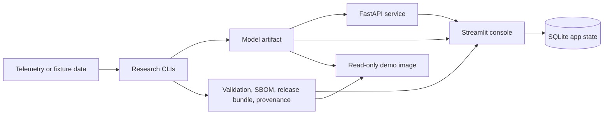

# Aerospace Prognostics

[](https://github.com/rosscyking1115/aerospace-prognostics/actions/workflows/ci.yml)


A production **ML-engineering / MLOps** system for aerospace Prognostics &
Health Management: familiar NASA benchmarks carried the whole way from raw
telemetry to a deployable, auditable, tested service. The engineering — not the
model score — is the point. Tested data and training CLIs, validation-gated
model promotion, signed release evidence (model card, SBOM, provenance, release
bundle), a FastAPI inference service with auth/metrics/drift monitoring, Docker
image smoke checks in CI, and an operator-facing review console.


> **If you are an ML-engineer / MLOps reviewer, read this first.** The headline
> is *not* another RUL score on C-MAPSS FD001 — that benchmark has been solved
> thousands of times and the model here is deliberately not the differentiator.
> The headline is that a familiar dataset is taken all the way to a deployable,
> auditable, tested system: reproducible CLIs instead of notebooks,
> validation-gated promotion that emits a model card + SBOM + provenance +
> release bundle, an authenticated inference API with request metrics and drift
> summaries, container contracts checked in CI, and a Streamlit review console
> for operator handoff. C-MAPSS is included precisely because it is the
> baseline any reviewer can independently check in five minutes; the delivery
> envelope around it is the work worth reviewing.

## Portfolio Status

- Scope: portfolio reference implementation for end-to-end PHM MLOps.
- License: MIT for the repository code.
- Demo: token-gated hosted read-only Streamlit console for review.
- Productization: frozen. Historical launch/productization docs are kept only
  as archived context and are not the active roadmap.
- Raw telemetry and generated model artifacts stay out of Git.

See [docs/mlops_portfolio_positioning.md](docs/mlops_portfolio_positioning.md)
for the hiring-manager framing and [docs/license_posture.md](docs/license_posture.md)
for the current open-source posture.

## Evidence At A Glance

| Area | Current Evidence |
| --- | --- |
| CI | `ruff`, `pytest`, dependency audit, SBOM generation, serving-image smoke tests, hosted-demo image smoke tests |
| Tests | `454 passed` on the latest full local suite; CI green on `main` |
| Data tracks | C-MAPSS turbofan RUL (familiar, checkable baseline) and spacecraft anomaly detection (SMAP/MSL today, ESA-ADB protocol-intake as the fresher forward track) |
| MLOps surfaces | FastAPI inference service, Streamlit review console, Docker Compose stack, token-gated Render demo |
| Release evidence | Model inspection, validation, benchmark, model card, SBOM, release bundle, promotion report, provenance |
| Current posture | Portfolio reference implementation under MIT; not a product launch track |

## What It Demonstrates

- C-MAPSS turbofan RUL baselines, sequence models, diagnostics, and calibrated
  prediction artifacts.
- SMAP/MSL spacecraft telemetry anomaly baselines and comparison reports.
- A deployable model artifact with validation, benchmark, model-card, SBOM,
  release-bundle, and provenance evidence.
- FastAPI inference with health, readiness, schema discovery, API-key
  protection, metrics, and drift summaries.
- Streamlit console for fleet triage, model registry, batch prediction,
  prediction history, outcome imports, operator decisions, and downloadable
  review evidence.
- Docker Compose for local API plus console integration, and a self-contained
  read-only hosted-demo image path.

## What Is Not Generic Here

A stock C-MAPSS tutorial ends at a notebook that reports RMSE on FD001. The
parts of this repo that deliberately go past that pattern — and are the things
worth reading closely:

- **NASA-aware asymmetric loss.** The deep RUL track trains against the NASA
  scoring asymmetry (late predictions are penalized harder than early ones)
  instead of plain RMSE, because in maintenance a late RUL call is the expensive
  failure mode. See `experiments/cmapss_deep_baseline.py`.
- **Inference-safe calibration.** A validation-fitted NASA-shift calibration is
  applied without ever touching the official test rows, so the reported
  improvement is honest rather than test-leaked. See
  `reports/cmapss_prediction_calibration.py`.
- **Monotonic / health-index regularization.** A mini-batch monotonic penalty
  discourages RUL from rising as an engine degrades — a physically meaningful
  constraint, not just a fit metric.
- **Validation-gated promotion (release-gating).** A model is only packaged and
  promoted after it clears validation and benchmark gates; promotion then emits
  the model card, SBOM, provenance, release bundle, and promotion report as a
  single reviewable artifact set. See `deployment/artifacts.py` and
  [docs/deployment.md](docs/deployment.md).
- **Honest benchmark framing.** The classical HGB policy still beats the deep
  model on FD001, and the repo says so plainly instead of cherry-picking. The
  value on show is the delivery discipline, not a leaderboard win.

## Architecture



See [docs/architecture.md](docs/architecture.md) for system boundaries,
evidence flow, runtime modes, and security controls.

## Benchmark Results (Deliberately Checkable)

Results are framed as *reproducible checkpoints a reviewer can verify*, not as
novel modelling claims. C-MAPSS is here as the familiar baseline everyone
already knows how to read; the interesting engineering is the envelope above,
not these numbers.

**C-MAPSS turbofan RUL — the baseline everyone can check.** The deployable RUL
leader is the validation-selected HGB policy: FD001 official-test RMSE
`13.012889`, NASA score `253.465322`. The strongest deep row is a calibrated
Transformer with asymmetric late-error loss and monotonic regularization at RMSE
`14.246672` / NASA score `271.486206` — behind HGB, and reported that way on
purpose.

**Spacecraft anomaly detection — moving off the most-seen benchmark.** The
SMAP/MSL track is a baseline and alert-policy layer: the comparison-ready robust
threshold policy lowers mean false-alarm rate from `0.187988` to `0.134247`
versus the default robust z-score baseline (mean point-wise F1 `0.160525`). The
forward direction here is **ESA-ADB** (the ESA Anomaly Detection Benchmark), a
much fresher and less-saturated dataset than SMAP/MSL. The repo now runs a first
real event-wise detection baseline on the ESA-ADB Mission1 lightweight subset —
event-wise precision `1.000`, recall `0.415`, F0.5 `0.780` on the chronological
test window (a conservative baseline, explicitly not a leaderboard claim) —
backed by a protocol-first intake with source manifest, archive validation, and
a fixture-tested evaluator contract. See
[docs/phase3_esa_adb_intake.md](docs/phase3_esa_adb_intake.md).

See [docs/public_results.md](docs/public_results.md) for the concise result
ledger and limitations.

## Visual Proof

The tracked proof set includes the read-only Streamlit console screenshot above,
a hosted-demo proof screenshot, and a quickstart RUL diagnostic plot in
[docs/public_proof_assets.md](docs/public_proof_assets.md). They show the
reviewable MLOps envelope without requiring NASA/JPL data downloads.

## Run This First

The no-download quickstart uses tiny fixture data to generate a complete local
evidence bundle and app database:

```powershell
uv sync --dev
uv run aerospace-prognostics quickstart-cmapss-demo
uv run aerospace-prognostics app-init-db
uv run streamlit run src/aerospace_prognostics/app/streamlit_app.py
```

The commands create dashboard, release, provenance, artifact-inspection,
model-card, validation, benchmark, and SBOM artifacts under
`artifacts/quickstart_cmapss`, then seed SQLite app state under `artifacts/app`.
See [docs/first_run.md](docs/first_run.md) for the console-only, Compose, and
read-only demo paths, or [docs/quickstart.md](docs/quickstart.md) for fixture
evidence details.

## Local MLOps Stack

To run the console and API together:

```powershell
uv run aerospace-prognostics quickstart-cmapss-demo
docker compose up --build
```

Open the console at `http://127.0.0.1:8501`, or check API readiness at
`http://127.0.0.1:8000/ready`. See
[docs/local_deployment.md](docs/local_deployment.md).

For a self-contained read-only console image:

```bash
docker build -f Dockerfile.demo -t aerospace-prognostics-demo:local .
docker run --rm --read-only --tmpfs /tmp:rw,nosuid,nodev,noexec,size=128m -p 8501:8501 aerospace-prognostics-demo:local
```

See [docs/hosted_demo.md](docs/hosted_demo.md).

## Repository Map

- [docs/mlops_portfolio_positioning.md](docs/mlops_portfolio_positioning.md):
  hiring-manager framing and what to surface.
- [docs/first_run.md](docs/first_run.md): choose the console-only, Compose, or
  read-only demo first-run path.
- [docs/architecture.md](docs/architecture.md): system boundaries, evidence
  flow, runtime modes, and security controls.
- [docs/public_results.md](docs/public_results.md): concise benchmark and
  deployment-evidence summary with limitations.
- [docs/quickstart.md](docs/quickstart.md): no-download quickstart.
- [docs/deployment.md](docs/deployment.md): model packaging, serving, release
  evidence, and promotion workflow.
- [docs/local_deployment.md](docs/local_deployment.md): Docker Compose API and
  console stack.
- [docs/hosted_demo.md](docs/hosted_demo.md): read-only demo image path.
- [docs/phase1_cmapss_baseline_results.md](docs/phase1_cmapss_baseline_results.md):
  C-MAPSS classical baseline results.
- [docs/phase2_cmapss_deep_baselines.md](docs/phase2_cmapss_deep_baselines.md):
  C-MAPSS sequence-model experiments.
- [docs/phase2_spacecraft_anomaly_baselines.md](docs/phase2_spacecraft_anomaly_baselines.md):
  SMAP/MSL anomaly experiments.
- [docs/phase3_uncertainty_monotonicity.md](docs/phase3_uncertainty_monotonicity.md):
  research evidence board for uncertainty, calibration, and diagnostics.
- [docs/phase3_esa_adb_intake.md](docs/phase3_esa_adb_intake.md):
  ESA-ADB protocol intake before benchmark claims.
- [docs/command_catalog.md](docs/command_catalog.md): detailed research,
  deployment, and app command catalog.
- [docs/project_checklist.md](docs/project_checklist.md): living execution
  checklist.
- [docs/repo_launch_strategy.md](docs/repo_launch_strategy.md): quarantined
  historical launch strategy, not an active plan.
- [docs/pre_phase3_readiness.md](docs/pre_phase3_readiness.md): quarantined
  historical productization gate, not an active Phase 3 prerequisite.

The original working plan is tracked in
[Aerospace_Prognostics_Project_Plan.md](Aerospace_Prognostics_Project_Plan.md).

## Development

```powershell
uv sync --dev
uv run ruff check .
uv run pytest
```

Raw telemetry and trained artifacts are intentionally ignored by Git. Keep
datasets under `data/` or another documented local path, and record source URLs
and checksums when adding download scripts.

Telemanom's current README points users to the Kaggle-hosted SMAP/MSL archive.
If the legacy public S3 archive is unavailable, download
`patrickfleith/nasa-anomaly-detection-dataset-smap-msl` to
`data/raw/downloads/smap_msl_telemanom.zip`, then rerun `smap-msl-download`; the
command imports that local archive without downloading it again.
