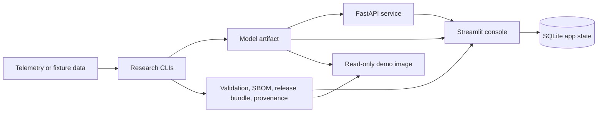

# Aerospace Prognostics

[](https://github.com/rosscyking1115/aerospace-prognostics/actions/workflows/ci.yml)


Production-grade aerospace Prognostics & Health Management for fleet triage,
model evidence, and deployment-ready inference.


Aerospace Prognostics combines turbofan Remaining Useful Life prediction,
spacecraft telemetry anomaly detection, release evidence, a FastAPI serving
surface, and a Streamlit operator console. The project is built as an
operations tool and engineering reference for aerospace PHM workflows, not as a
notebook-only lab demo.

## Portfolio Status

This repository is currently private review only. It is not open-source
licensed yet; external reuse, redistribution, or production use is not granted
until a public-launch license is chosen. Reviewer evidence is available through
tracked screenshots, CI evidence, and a token-gated hosted read-only demo.

See [docs/license_posture.md](docs/license_posture.md) and
[docs/private_hosting_handoff.md](docs/private_hosting_handoff.md).

## Evidence At A Glance

| Area | Current Evidence |
| --- | --- |
| CI | `ruff`, `pytest`, dependency audit, SBOM generation, serving-image smoke tests, hosted-demo image smoke tests |
| Tests | `414 passed` on the latest full local suite; CI green on `main` |
| Data tracks | NASA C-MAPSS turbofan RUL and NASA/JPL SMAP/MSL spacecraft telemetry anomaly detection |
| Product surfaces | FastAPI inference service, Streamlit operations console, Docker Compose stack, token-gated Render demo |
| Release evidence | Model inspection, validation, benchmark, model card, SBOM, release bundle, promotion report, provenance |
| Current posture | Private review, `UNLICENSED`, public launch pending final license decision |

## What It Does

- Builds C-MAPSS turbofan RUL baselines, sequence models, diagnostics, and
  calibrated prediction artifacts.
- Builds SMAP/MSL spacecraft telemetry anomaly baselines and comparison reports.
- Packages a deployable model artifact with validation, benchmark, model-card,
  SBOM, release-bundle, and provenance evidence.
- Serves predictions through FastAPI with health, readiness, schema discovery,
  API-key protection, metrics, and drift summaries.
- Provides a Streamlit operations console for fleet triage, model registry,
  batch prediction, prediction history, outcome imports, operator decisions, and
  downloadable review evidence.
- Supports Docker Compose for a local API plus console product stack, and a
  read-only hosted-demo image path with baked-in quickstart evidence.

## Architecture



See [docs/architecture.md](docs/architecture.md) for the full system boundary,
evidence flow, runtime modes, and security controls.

## Current Results

The current deployable RUL leader is the validation-selected C-MAPSS HGB policy.
On FD001 it reports official-test RMSE `13.012889` and NASA score
`253.465322`. The strongest deep FD001 row so far is a calibrated Transformer
with asymmetric late-error loss and monotonic regularization, at RMSE
`14.246672` and NASA score `271.486206`.

The SMAP/MSL anomaly track currently provides a baseline and alert-policy layer:
the comparison-ready robust threshold policy lowers mean false-alarm rate from
`0.187988` to `0.134247` versus the default robust z-score baseline, with mean
point-wise F1 `0.160525`.

See [docs/public_results.md](docs/public_results.md) for the concise result
ledger and limitations.

## Visual Proof

The tracked public proof set includes this read-only Streamlit console screenshot
above, a hosted-demo proof screenshot, and a quickstart RUL diagnostic plot in
[docs/public_proof_assets.md](docs/public_proof_assets.md). They summarize the
no-download quickstart evidence while the repository remains private.

## Run This First

The no-download quickstart uses tiny fixture data to generate a complete local
evidence bundle and app database:

```powershell
uv sync --dev
uv run aerospace-prognostics quickstart-cmapss-demo
uv run aerospace-prognostics app-init-db
uv run streamlit run src/aerospace_prognostics/app/streamlit_app.py
```

The commands create dashboard, release, provenance, artifact-inspection,
model-card, validation, benchmark, and SBOM artifacts under
`artifacts/quickstart_cmapss`, then seed SQLite app state under `artifacts/app`.
See [docs/first_run.md](docs/first_run.md) for the console-only, Compose, and
read-only demo paths, or [docs/quickstart.md](docs/quickstart.md) for the
fixture evidence details.

## Local Product Stack

To run the console and API together:

```powershell
uv run aerospace-prognostics quickstart-cmapss-demo
docker compose up --build
```

Open the console at `http://127.0.0.1:8501`, or check API readiness at
`http://127.0.0.1:8000/ready`. See
[docs/local_deployment.md](docs/local_deployment.md).

For a self-contained read-only console image:

```bash
docker build -f Dockerfile.demo -t aerospace-prognostics-demo:local .
docker run --rm --read-only --tmpfs /tmp:rw,nosuid,nodev,noexec,size=128m -p 8501:8501 aerospace-prognostics-demo:local
```

See [docs/hosted_demo.md](docs/hosted_demo.md).

## Repository Map

- [docs/first_run.md](docs/first_run.md): choose the console-only, Compose, or
  read-only demo first-run path.
- [docs/architecture.md](docs/architecture.md): system boundaries, evidence
  flow, runtime modes, and security controls.
- [docs/public_results.md](docs/public_results.md): concise benchmark and
  deployment-evidence summary with limitations.
- [docs/quickstart.md](docs/quickstart.md): no-download product quickstart.
- [docs/deployment.md](docs/deployment.md): model packaging, serving, release
  evidence, and promotion workflow.
- [docs/local_deployment.md](docs/local_deployment.md): Docker Compose API and
  console stack.
- [docs/hosted_demo.md](docs/hosted_demo.md): read-only demo image path.
- [docs/phase1_cmapss_baseline_results.md](docs/phase1_cmapss_baseline_results.md):
  C-MAPSS classical baseline results.
- [docs/phase2_cmapss_deep_baselines.md](docs/phase2_cmapss_deep_baselines.md):
  C-MAPSS sequence-model experiments.
- [docs/phase2_spacecraft_anomaly_baselines.md](docs/phase2_spacecraft_anomaly_baselines.md):
  SMAP/MSL anomaly experiments.
- [docs/command_catalog.md](docs/command_catalog.md): detailed research,
  deployment, and app command catalog.
- [docs/public_proof_assets.md](docs/public_proof_assets.md): launch proof
  visuals and evidence-source notes.
- [docs/project_checklist.md](docs/project_checklist.md): living execution
  checklist.
- [docs/license_posture.md](docs/license_posture.md): current private-review
  license posture before public release.
- [docs/pre_phase3_readiness.md](docs/pre_phase3_readiness.md): gate for
  finishing launch/productization work before Phase 3.
- [docs/private_hosting_handoff.md](docs/private_hosting_handoff.md): private
  hosted-demo setup handoff and proof checklist.
- [docs/repo_launch_strategy.md](docs/repo_launch_strategy.md): public-launch
  strategy and evidence gaps.

The original working plan is tracked in
[Aerospace_Prognostics_Project_Plan.md](Aerospace_Prognostics_Project_Plan.md).

## Development

```powershell
uv sync --dev
uv run ruff check .
uv run pytest
```

Raw telemetry and trained artifacts are intentionally ignored by Git. Keep
datasets under `data/` or another documented local path, and record source URLs
and checksums when adding download scripts.

Telemanom's current README points users to the Kaggle-hosted SMAP/MSL archive.
If the legacy public S3 archive is unavailable, download
`patrickfleith/nasa-anomaly-detection-dataset-smap-msl` to
`data/raw/downloads/smap_msl_telemanom.zip`, then rerun `smap-msl-download`; the
command imports that local archive without downloading it again.
