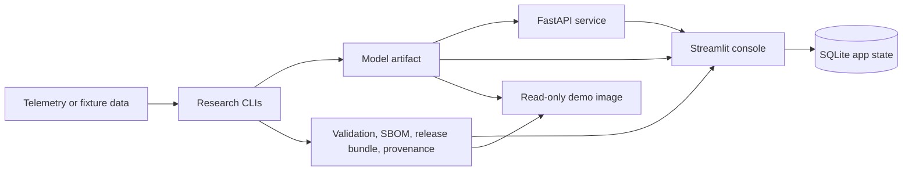

# Aerospace Prognostics

[](https://github.com/rosscyking1115/aerospace-prognostics/actions/workflows/ci.yml)


**Deployable ML engineering for aerospace prognostics: familiar NASA
benchmarks and a fresh anomaly-detection benchmark, carried through their real
protocols and wrapped in a production serving, evidence, and release stack.**


Most predictive-maintenance repos are a notebook and a leaderboard score. This
one is an **operations system**: a FastAPI inference service, a Streamlit
operator console, signed release evidence (model card, SBOM, provenance), and
drift monitoring, all wrapped around models that are trained and evaluated
under honest, documented protocols. The engineering envelope is the point; the
models are held to it.

The anomaly-evaluation layer proved general enough to extract. It now lives as
**[telemeval](https://github.com/rosscyking1115/telemeval)**, a standalone
Apache-2.0 library for leakage-safe, event-wise and affiliation-based
evaluation of spacecraft-telemetry anomaly detection, and this repository is
its **reference pipeline**, consuming it as a dependency. Full project map →
[profile](https://github.com/rosscyking1115).

## What makes this repo different

- **A fresh benchmark, not another C-MAPSS score.** The anomaly-detection track
  runs on **ESA-ADB** (ESA spacecraft telemetry) through its real event-wise
  protocol, a benchmark far less picked-over than the usual suspects. C-MAPSS is
  kept only as a familiar baseline anyone can cross-check.
- **Results audited for leakage, and the correction reported.** The first
  ESA-ADB run reported recall `0.24`; auditing the evaluation showed the
  chronological split was counting training-window events (which have no
  test-window predictions) as missed, deflating recall. Restricting scoring to
  test-window events (the correct protocol) gives the honest **`0.42`**, and the
  corrected number is the one reported.
  (See [docs/public_results.md](docs/public_results.md).)
- **Provenance and guardrails on every result.** Each artifact records its
  protocol deviations and is stamped *"event-wise detection only — not a full
  ESA-ADB leaderboard claim."* Nothing is overstated. The evaluation layer,
  including the leakage guard born from that audit, is extracted and
  maintained as the standalone [telemeval](https://github.com/rosscyking1115/telemeval) library, which this
  pipeline consumes.
- **A production envelope.** Serving API, operator console, release evidence,
  SBOM, provenance, drift summaries, and 451 tests, plus the extracted
  telemeval library's own CI-tested suite. These are the parts that make it
  deployable ML engineering rather than a one-off experiment.

## Status and scope

- Scope: a reference implementation of end-to-end PHM MLOps.
- License: MIT for the repository code.
- Demo: token-gated hosted read-only Streamlit console for review.
- Productization: frozen. Historical launch/productization docs are kept only
  as archived context and are not the active roadmap.
- Raw telemetry and generated model artifacts stay out of Git.

See [docs/license_posture.md](docs/license_posture.md) for the current
open-source posture.

## Evidence at a glance

| Area | Current evidence |
| --- | --- |
| CI | `ruff`, `pytest`, dependency audit, SBOM generation, serving-image smoke tests, hosted-demo image smoke tests |
| Tests | `451 passed` on the latest full local suite; the extracted [telemeval](https://github.com/rosscyking1115/telemeval) library is separately CI-tested |
| Data tracks | C-MAPSS turbofan RUL (familiar, checkable baseline) and spacecraft anomaly detection (SMAP/MSL plumbing, plus a first real event-wise baseline on the fresher ESA-ADB Mission1 subset) |
| MLOps surfaces | FastAPI inference service, Streamlit review console, Docker Compose stack, token-gated Render demo |
| Release evidence | Model inspection, validation, benchmark, model card, SBOM, release bundle, promotion report, provenance |
| Current posture | Reference implementation under MIT; not a product launch track |

## What it includes

- C-MAPSS turbofan RUL baselines, sequence models, diagnostics, and calibrated
  prediction artifacts.
- SMAP/MSL spacecraft telemetry anomaly baselines and comparison reports.
- A deployable model artifact with validation, benchmark, model-card, SBOM,
  release-bundle, and provenance evidence.
- FastAPI inference with health, readiness, schema discovery, API-key
  protection, metrics, and drift summaries.
- Streamlit console for fleet triage, model registry, batch prediction,
  prediction history, outcome imports, operator decisions, and downloadable
  review evidence.
- Docker Compose for local API plus console integration, and a self-contained
  read-only hosted-demo image path.

## What is not generic here

A stock C-MAPSS tutorial ends at a notebook that reports RMSE on FD001. The
parts of this repo that deliberately go past that pattern, and are the things
worth reading closely:

- **NASA-aware asymmetric loss.** The deep RUL track trains against the NASA
  scoring asymmetry (late predictions are penalized harder than early ones)
  instead of plain RMSE, because in maintenance a late RUL call is the expensive
  failure mode. See `experiments/cmapss_deep_baseline.py`.
- **Inference-safe calibration.** A validation-fitted NASA-shift calibration is
  applied without ever touching the official test rows, so the reported
  improvement is honest rather than test-leaked. See
  `reports/cmapss_prediction_calibration.py`.
- **Monotonic / health-index regularization.** A mini-batch monotonic penalty
  discourages RUL from rising as an engine degrades: a physically meaningful
  constraint, not just a fit metric.
- **Validation-gated promotion (release-gating).** A model is only packaged and
  promoted after it clears validation and benchmark gates; promotion then emits
  the model card, SBOM, provenance, release bundle, and promotion report as a
  single reviewable artifact set. See `deployment/artifacts.py` and
  [docs/deployment.md](docs/deployment.md).
- **Honest benchmark framing.** The classical HGB policy still beats the deep
  model on FD001, and the repo says so plainly instead of cherry-picking. The
  value on show is the delivery discipline, not a leaderboard win.

## Architecture



See [docs/architecture.md](docs/architecture.md) for system boundaries,
evidence flow, runtime modes, and security controls.

## Headline results

Results are framed as *reproducible checkpoints anyone can independently verify*, not as
novel modelling claims.

**ESA-ADB: lightweight event-wise detection baselines on both benchmark
missions** (robust z-score, fit on nominal training points only, scored on the
chronological test window):

| Mission | Threshold policy | Precision | Recall | F0.5 |
|---|---|---:|---:|---:|
| Mission 1 (ch 41–46) | fixed τ=5 | **1.000** | 0.415 | **0.780** |
| Mission 2 (ch 18–28) | validation-selected τ=20 | 0.999 | 0.986 | 0.997 |

The honest finding matters more than the numbers: a *single* fixed threshold is
precise on Mission 1 but over-alarms badly on Mission 2's noisier channels
(F0.5 0.43). A naive validation selection fixed Mission 2 but *overfit* Mission 1,
whose validation window is too sparse to discriminate. The selector now
falls back to the conservative default when the window can't be trusted (Mission 1
→ 0.780) and selects only when it can (Mission 2 → 0.997). "Trust validation
selection only when the validation window is informative" is the real lesson. The
full fixed-vs-validation comparison, and why Mission 2's numbers are lenient
rather than SOTA, are in [docs/public_results.md](docs/public_results.md).
Scope-bounded event-wise detection evidence (official resampling not yet applied),
not a leaderboard claim.

**C-MAPSS turbofan RUL: familiar baseline for cross-checking.** C-MAPSS is the
field's most-used RUL benchmark, included here as a known reference anyone can
verify against, not as the centrepiece. The validation-selected HGB policy
reports FD001 official-test RMSE **`13.01`** / NASA score **`253.5`**; the
strongest deep row is a calibrated Transformer with asymmetric late-error loss
and monotonic regularization at RMSE `14.25`, behind HGB, and reported that way
on purpose. Details in
[docs/phase1_cmapss_baseline_results.md](docs/phase1_cmapss_baseline_results.md)
and [docs/phase2_cmapss_deep_baselines.md](docs/phase2_cmapss_deep_baselines.md).

**SMAP/MSL: anomaly plumbing.** The earlier SMAP/MSL track remains as a
baseline and alert-policy layer: the comparison-ready robust threshold policy
lowers mean false-alarm rate from `0.187988` to `0.134247` versus the default
robust z-score baseline (mean point-wise F1 `0.160525`).

## Visual proof

The tracked proof set includes the read-only Streamlit console screenshot above,
a hosted-demo proof screenshot, and a quickstart RUL diagnostic plot in
[docs/public_proof_assets.md](docs/public_proof_assets.md). They show the
reviewable MLOps envelope without requiring NASA/JPL data downloads.

## Run this first

The no-download quickstart uses tiny fixture data to generate a complete local
evidence bundle and app database:

```powershell
uv sync --dev
uv run aerospace-prognostics quickstart-cmapss-demo
uv run aerospace-prognostics app-init-db
uv run streamlit run src/aerospace_prognostics/app/streamlit_app.py
```

The commands create dashboard, release, provenance, artifact-inspection,
model-card, validation, benchmark, and SBOM artifacts under
`artifacts/quickstart_cmapss`, then seed SQLite app state under `artifacts/app`.
See [docs/first_run.md](docs/first_run.md) for the console-only, Compose, and
read-only demo paths, or [docs/quickstart.md](docs/quickstart.md) for fixture
evidence details.

## Local MLOps stack

To run the console and API together:

```powershell
uv run aerospace-prognostics quickstart-cmapss-demo
docker compose up --build
```

Open the console at `http://127.0.0.1:8501`, or check API readiness at
`http://127.0.0.1:8000/ready`. See
[docs/local_deployment.md](docs/local_deployment.md).

For a self-contained read-only console image:

```bash
docker build -f Dockerfile.demo -t aerospace-prognostics-demo:local .
docker run --rm --read-only --tmpfs /tmp:rw,nosuid,nodev,noexec,size=128m -p 8501:8501 aerospace-prognostics-demo:local
```

See [docs/hosted_demo.md](docs/hosted_demo.md).

## Repository map

- [docs/first_run.md](docs/first_run.md): choose the console-only, Compose, or
  read-only demo first-run path.
- [docs/architecture.md](docs/architecture.md): system boundaries, evidence
  flow, runtime modes, and security controls.
- [docs/public_results.md](docs/public_results.md): concise benchmark and
  deployment-evidence summary with limitations.
- [docs/quickstart.md](docs/quickstart.md): no-download quickstart.
- [docs/deployment.md](docs/deployment.md): model packaging, serving, release
  evidence, and promotion workflow.
- [docs/local_deployment.md](docs/local_deployment.md): Docker Compose API and
  console stack.
- [docs/hosted_demo.md](docs/hosted_demo.md): read-only demo image path.
- [docs/phase1_cmapss_baseline_results.md](docs/phase1_cmapss_baseline_results.md):
  C-MAPSS classical baseline results.
- [docs/phase2_cmapss_deep_baselines.md](docs/phase2_cmapss_deep_baselines.md):
  C-MAPSS sequence-model experiments.
- [docs/phase2_spacecraft_anomaly_baselines.md](docs/phase2_spacecraft_anomaly_baselines.md):
  SMAP/MSL anomaly experiments.
- [docs/phase3_uncertainty_monotonicity.md](docs/phase3_uncertainty_monotonicity.md):
  research evidence board for uncertainty, calibration, and diagnostics.
- [docs/phase3_esa_adb_intake.md](docs/phase3_esa_adb_intake.md):
  ESA-ADB protocol intake before benchmark claims.
- [docs/command_catalog.md](docs/command_catalog.md): detailed research,
  deployment, and app command catalog.
- [docs/repo_launch_strategy.md](docs/repo_launch_strategy.md): quarantined
  historical launch strategy, not an active plan.

## Development

```powershell
uv sync --dev
uv run ruff check .
uv run pytest
```

Raw telemetry and trained artifacts are intentionally ignored by Git. Keep
datasets under `data/` or another documented local path, and record source URLs
and checksums when adding download scripts.

Telemanom's current README points users to the Kaggle-hosted SMAP/MSL archive.
If the legacy public S3 archive is unavailable, download
`patrickfleith/nasa-anomaly-detection-dataset-smap-msl` to
`data/raw/downloads/smap_msl_telemanom.zip`, then rerun `smap-msl-download`; the
command imports that local archive without downloading it again.
