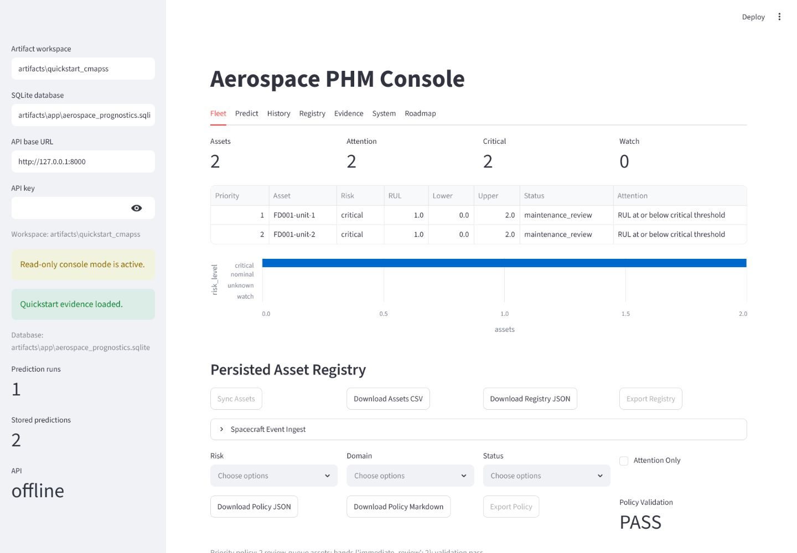
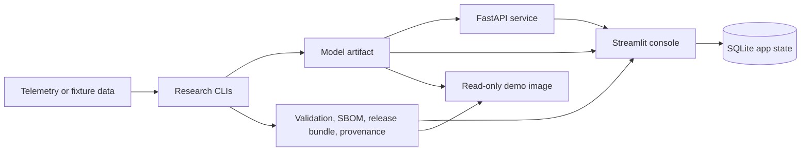

# Aerospace Prognostics

[](https://github.com/rosscyking1115/aerospace-prognostics/actions/workflows/ci.yml)


End-to-end aerospace Prognostics & Health Management MLOps reference
implementation: common NASA benchmarks wrapped with serving, evidence,
observability, CI, containers, and an operator-facing console.



This is an ML-engineer/MLOps portfolio project, not a commercial PHM product.
NASA C-MAPSS is a heavily used predictive-maintenance benchmark, so the point
is not to pretend the model is novel. The differentiator is the production
wrapper around familiar datasets: tested pipelines, model packaging, FastAPI
serving, release evidence, SBOM, provenance, drift summaries, Docker smoke
checks, and a Streamlit review console.

## Portfolio Status

- Scope: portfolio reference implementation for end-to-end PHM MLOps.
- License: MIT for the repository code.
- Demo: token-gated hosted read-only Streamlit console for review.
- Productization: frozen. Historical launch/productization docs are kept only
  as archived context and are not the active roadmap.
- Raw telemetry and generated model artifacts stay out of Git.

See [docs/mlops_portfolio_positioning.md](docs/mlops_portfolio_positioning.md)
for the hiring-manager framing and [docs/license_posture.md](docs/license_posture.md)
for the current open-source posture.

## Evidence At A Glance

| Area | Current Evidence |
| --- | --- |
| CI | `ruff`, `pytest`, dependency audit, SBOM generation, serving-image smoke tests, hosted-demo image smoke tests |
| Tests | `436 passed` on the latest full local suite; CI green on `main` |
| Data tracks | NASA C-MAPSS turbofan RUL and NASA/JPL SMAP/MSL spacecraft telemetry anomaly detection |
| MLOps surfaces | FastAPI inference service, Streamlit review console, Docker Compose stack, token-gated Render demo |
| Release evidence | Model inspection, validation, benchmark, model card, SBOM, release bundle, promotion report, provenance |
| Current posture | Portfolio reference implementation under MIT; not a product launch track |

## What It Demonstrates

- C-MAPSS turbofan RUL baselines, sequence models, diagnostics, and calibrated
  prediction artifacts.
- SMAP/MSL spacecraft telemetry anomaly baselines and comparison reports.
- A deployable model artifact with validation, benchmark, model-card, SBOM,
  release-bundle, and provenance evidence.
- FastAPI inference with health, readiness, schema discovery, API-key
  protection, metrics, and drift summaries.
- Streamlit console for fleet triage, model registry, batch prediction,
  prediction history, outcome imports, operator decisions, and downloadable
  review evidence.
- Docker Compose for local API plus console integration, and a self-contained
  read-only hosted-demo image path.

## Architecture



See [docs/architecture.md](docs/architecture.md) for system boundaries,
evidence flow, runtime modes, and security controls.

## Current Results

The current deployable RUL leader is the validation-selected C-MAPSS HGB policy.
On FD001 it reports official-test RMSE `13.012889` and NASA score
`253.465322`. The strongest deep FD001 row so far is a calibrated Transformer
with asymmetric late-error loss and monotonic regularization, at RMSE
`14.246672` and NASA score `271.486206`.

The SMAP/MSL anomaly track currently provides a baseline and alert-policy layer:
the comparison-ready robust threshold policy lowers mean false-alarm rate from
`0.187988` to `0.134247` versus the default robust z-score baseline, with mean
point-wise F1 `0.160525`.

These results are intentionally framed as benchmark evidence, not operational
claims. See [docs/public_results.md](docs/public_results.md) for the concise
result ledger and limitations.

## Visual Proof

The tracked proof set includes the read-only Streamlit console screenshot above,
a hosted-demo proof screenshot, and a quickstart RUL diagnostic plot in
[docs/public_proof_assets.md](docs/public_proof_assets.md). They show the
reviewable MLOps envelope without requiring NASA/JPL data downloads.

## Run This First

The no-download quickstart uses tiny fixture data to generate a complete local
evidence bundle and app database:

```powershell
uv sync --dev
uv run aerospace-prognostics quickstart-cmapss-demo
uv run aerospace-prognostics app-init-db
uv run streamlit run src/aerospace_prognostics/app/streamlit_app.py
```

The commands create dashboard, release, provenance, artifact-inspection,
model-card, validation, benchmark, and SBOM artifacts under
`artifacts/quickstart_cmapss`, then seed SQLite app state under `artifacts/app`.
See [docs/first_run.md](docs/first_run.md) for the console-only, Compose, and
read-only demo paths, or [docs/quickstart.md](docs/quickstart.md) for fixture
evidence details.

## Local MLOps Stack

To run the console and API together:

```powershell
uv run aerospace-prognostics quickstart-cmapss-demo
docker compose up --build
```

Open the console at `http://127.0.0.1:8501`, or check API readiness at
`http://127.0.0.1:8000/ready`. See
[docs/local_deployment.md](docs/local_deployment.md).

For a self-contained read-only console image:

```bash
docker build -f Dockerfile.demo -t aerospace-prognostics-demo:local .
docker run --rm --read-only --tmpfs /tmp:rw,nosuid,nodev,noexec,size=128m -p 8501:8501 aerospace-prognostics-demo:local
```

See [docs/hosted_demo.md](docs/hosted_demo.md).

## Repository Map

- [docs/mlops_portfolio_positioning.md](docs/mlops_portfolio_positioning.md):
  hiring-manager framing and what to surface.
- [docs/first_run.md](docs/first_run.md): choose the console-only, Compose, or
  read-only demo first-run path.
- [docs/architecture.md](docs/architecture.md): system boundaries, evidence
  flow, runtime modes, and security controls.
- [docs/public_results.md](docs/public_results.md): concise benchmark and
  deployment-evidence summary with limitations.
- [docs/quickstart.md](docs/quickstart.md): no-download quickstart.
- [docs/deployment.md](docs/deployment.md): model packaging, serving, release
  evidence, and promotion workflow.
- [docs/local_deployment.md](docs/local_deployment.md): Docker Compose API and
  console stack.
- [docs/hosted_demo.md](docs/hosted_demo.md): read-only demo image path.
- [docs/phase1_cmapss_baseline_results.md](docs/phase1_cmapss_baseline_results.md):
  C-MAPSS classical baseline results.
- [docs/phase2_cmapss_deep_baselines.md](docs/phase2_cmapss_deep_baselines.md):
  C-MAPSS sequence-model experiments.
- [docs/phase2_spacecraft_anomaly_baselines.md](docs/phase2_spacecraft_anomaly_baselines.md):
  SMAP/MSL anomaly experiments.
- [docs/phase3_uncertainty_monotonicity.md](docs/phase3_uncertainty_monotonicity.md):
  research evidence board for uncertainty, calibration, and diagnostics.
- [docs/phase3_esa_adb_intake.md](docs/phase3_esa_adb_intake.md):
  ESA-ADB protocol intake before benchmark claims.
- [docs/command_catalog.md](docs/command_catalog.md): detailed research,
  deployment, and app command catalog.
- [docs/project_checklist.md](docs/project_checklist.md): living execution
  checklist.
- [docs/repo_launch_strategy.md](docs/repo_launch_strategy.md): quarantined
  historical launch strategy, not an active plan.
- [docs/pre_phase3_readiness.md](docs/pre_phase3_readiness.md): quarantined
  historical productization gate, not an active Phase 3 prerequisite.

The original working plan is tracked in
[Aerospace_Prognostics_Project_Plan.md](Aerospace_Prognostics_Project_Plan.md).

## Development

```powershell
uv sync --dev
uv run ruff check .
uv run pytest
```

Raw telemetry and trained artifacts are intentionally ignored by Git. Keep
datasets under `data/` or another documented local path, and record source URLs
and checksums when adding download scripts.

Telemanom's current README points users to the Kaggle-hosted SMAP/MSL archive.
If the legacy public S3 archive is unavailable, download
`patrickfleith/nasa-anomaly-detection-dataset-smap-msl` to
`data/raw/downloads/smap_msl_telemanom.zip`, then rerun `smap-msl-download`; the
command imports that local archive without downloading it again.
