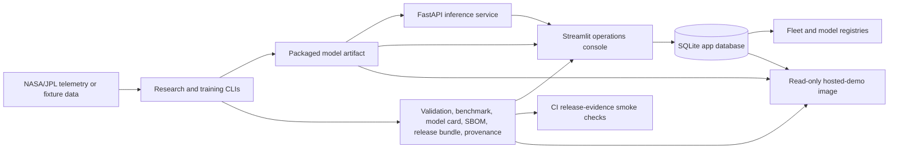

# System Architecture

Aerospace Prognostics is organized as a small production-grade PHM system:
research workflows create model and evidence artifacts, deployment workflows
package and validate those artifacts, and product surfaces expose them through
an API and operations console.

## Architecture At A Glance

## Main Boundaries

- Research boundary: C-MAPSS RUL and SMAP/MSL anomaly workflows run through
  tested CLIs and write generated artifacts under ignored local paths.
- Release boundary: packaged model artifacts are paired with inspection,
  validation, benchmark, model-card, SBOM, promotion, release-bundle, and
  provenance evidence.
- Serving boundary: FastAPI exposes health, readiness, schema, metrics, and
  authenticated prediction routes around a mounted model artifact.
- Operations boundary: Streamlit gives engineers a console for fleet triage,
  batch prediction, model registry review, release evidence inspection,
  prediction history, operator decisions, and downloads.
- Persistence boundary: SQLite stores app state for local and hosted-demo use,
  with a data model intended to migrate to Postgres later.
- Demo boundary: `Dockerfile.demo` bakes in quickstart evidence and starts the
  console in read-only mode so reviewers can inspect evidence without mutating
  state.

## Evidence Flow

1. Ingest or fixture generation creates telemetry-like inputs without committing
   raw data.
2. Training and baseline CLIs produce result tables, diagnostics, and candidate
   models.
3. Packaging writes a model artifact and metadata with a stable artifact ID and
   SHA-256 digest.
4. Validation, benchmark, model-card, SBOM, promotion, release-bundle, and
   provenance steps create reviewable release evidence.
5. The app database registers model artifacts, release evidence, prediction
   runs, fleet assets, outcomes, and operator decisions.
6. The console and API read from the same artifact/evidence contract, so local
   review, Compose deployment, and hosted read-only demo use the same story.

## Runtime Modes

| Mode | Surface | State | Best Use |
| --- | --- | --- | --- |
| Console-only quickstart | Streamlit | Local SQLite and ignored artifacts | Fastest first run and evidence inspection |
| Local product stack | FastAPI plus Streamlit through Compose | Shared local artifacts and SQLite | API-console integration and smoke testing |
| Read-only demo image | Streamlit only | Baked-in quickstart evidence and seeded SQLite | Private hosted review without write access |
| CI release smoke | CLI plus Docker checks | Temporary generated evidence | Regression protection for packaging and serving |

## Security And Operational Controls

- Raw telemetry, generated model binaries, SQLite databases, and release outputs
  stay out of Git.
- API prediction routes use API-key authentication and local rate limiting.
- The serving image excludes training-only PyTorch dependencies and is checked
  in CI for its runtime dependency surface.
- Read-only console mode disables telemetry upload, prediction persistence,
  outcome imports, operator decisions, file-writing exports, and automatic
  database seeding.
- CI validates release evidence, SBOM generation, container healthcheck
  behavior, mounted-model smoke tests, and hosted-demo image contract.

## What This Architecture Is Not

- It is not a certification-grade aerospace safety system.
- It is not claiming state-of-the-art model performance.
- It is not committing raw NASA/JPL telemetry or generated model artifacts.
- It is not yet a managed cloud deployment with durable object storage,
  Postgres, identity provider integration, and audit-retention policy.

The current design is a production-grade reference architecture for PHM
engineering workflows: reproducible data paths, explicit model evidence,
deployable serving contracts, and operator-facing review surfaces.
