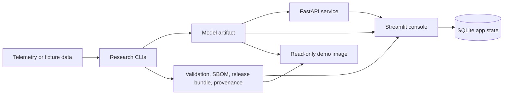

# The engineering envelope

A stock C-MAPSS tutorial ends at a notebook reporting RMSE on FD001. This page describes
the surfaces built around the models instead — serving, evidence, release gating,
monitoring — and the modelling decisions that deliberately go past the tutorial pattern.

The envelope is the part of this project worth reading closely. The models are held to it,
not the other way round.

## Evidence at a glance

| Area | Current evidence |
| --- | --- |
| CI | `ruff`, `pytest`, dependency audit, SBOM generation, serving-image smoke tests, demo-image contract and smoke tests |
| Tests | Full suite green in CI on every push and PR, across Python 3.11/3.12/3.13. No count is published here — run `uv run pytest` to get the current one. The suite includes a *skill* test, not just plumbing: the learned baseline must beat the naive floor on a fixture built so a constant predictor cannot win, so an estimator that lost its predictive power turns CI red. The extracted [telemeval](https://github.com/rosscyking1115/telemeval) library is separately CI-tested |
| Data tracks | C-MAPSS turbofan RUL (familiar, checkable baseline) and spacecraft anomaly detection (SMAP/MSL plumbing, plus event-wise baselines on the ESA-ADB Mission1 and Mission2 lightweight subsets — detection tier only, no comparison set) |
| MLOps surfaces | FastAPI inference service, Streamlit operator console, Docker Compose stack |
| Release evidence | Model inspection, validation, benchmark, model card, SBOM, release bundle, promotion report, provenance |
| Claims | Every published number is traced in [../claims.md](../claims.md) to what produced it, what it may support, and whether anything about it is disclosed-but-unresolved |
| Current posture | Reference implementation under MIT; not a product launch track |

## What it includes

- C-MAPSS turbofan RUL baselines, sequence models, diagnostics, and calibrated prediction
  artifacts.
- SMAP/MSL spacecraft telemetry anomaly baselines and comparison reports.
- ESA-ADB lightweight event-wise detection baselines for Mission1 and Mission2.
- A deployable model artifact with validation, benchmark, model-card, SBOM,
  release-bundle, and provenance evidence.
- FastAPI inference with health, readiness, schema discovery, API-key protection,
  metrics, and drift summaries.
- Streamlit console for fleet triage, model registry, batch prediction, prediction
  history, outcome imports, operator decisions, and downloadable review evidence.
- Docker Compose for local API plus console integration, and a self-contained read-only
  demo image path.

## What is not generic here

The parts that deliberately go past the tutorial pattern:

- **NASA-aware asymmetric loss.** The deep RUL track trains against the NASA scoring
  asymmetry (late predictions are penalized harder than early ones) instead of plain RMSE,
  because in maintenance a late RUL call is the expensive failure mode. See
  `src/aerospace_prognostics/experiments/cmapss_deep_baseline.py`.
- **Inference-safe calibration.** A validation-fitted NASA-shift calibration is applied
  without ever touching the official test rows, so the reported improvement is honest
  rather than test-leaked. See
  `src/aerospace_prognostics/reports/cmapss_prediction_calibration.py`.
- **Monotonic / health-index regularization.** A mini-batch monotonic penalty discourages
  RUL from rising as an engine degrades: a physically meaningful constraint, not just a
  fit metric.
- **Validation-gated promotion (release-gating).** A model is only packaged and promoted
  after it clears validation and benchmark gates; promotion then emits the model card,
  SBOM, provenance, release bundle, and promotion report as a single reviewable artifact
  set. See `src/aerospace_prognostics/deployment/artifacts.py` and
  [deployment.md](deployment.md).
- **Honest benchmark framing.** The classical HGB policy still beats the deep model on
  FD001, and the repo says so plainly instead of cherry-picking. The value on show is the
  delivery discipline, not a leaderboard win.

## Architecture



See [architecture.md](architecture.md) for system boundaries, evidence flow, runtime
modes, and security controls.

## Running the local stack

To run the console and API together:

```powershell
uv run aerospace-prognostics quickstart-cmapss-demo
docker compose up --build
```

Open the console at `http://127.0.0.1:8501`, or check API readiness at
`http://127.0.0.1:8000/ready`. See [local_deployment.md](local_deployment.md).

For a self-contained read-only console image:

```bash
docker build -f Dockerfile.demo -t aerospace-prognostics-demo:local .
docker run --rm --read-only --tmpfs /tmp:rw,nosuid,nodev,noexec,size=128m -p 8501:8501 aerospace-prognostics-demo:local
```

There is no hosted instance of either. See [hosted_demo.md](hosted_demo.md) for the
demo-image path and why the previously hosted service was retired.
