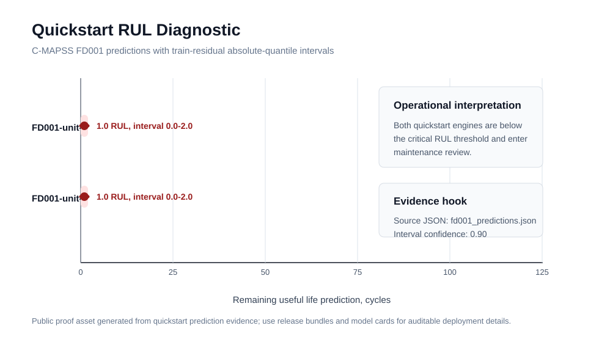

# Visual Proof Assets

These tracked visual assets are a small proof set for the project. They are
small enough to live in Git and are tied to the no-download quickstart evidence
rather than raw telemetry or generated model binaries.

## Assets


The static fleet snapshot summarizes
`artifacts/quickstart_cmapss/dashboard/fleet_payload.json` and
`artifacts/quickstart_cmapss/models/fd001_benchmark.json`. It shows the MLOps
story at a glance: fleet triage, release gates, artifact identity, and latency
evidence.



The RUL diagnostic summarizes
`artifacts/quickstart_cmapss/predictions/fd001_predictions.json`. Both sample
FD001 engines are critical quickstart cases with predicted RUL of `1.0` and
90 percent intervals from `0.0` to `2.0`, using the
`train_residual_absolute_quantile` interval method.

## Regeneration Path

Regenerate the source evidence with the no-download quickstart, then refresh the
assets from the regenerated payloads:

```bash
uv run aerospace-prognostics quickstart-cmapss-demo
```

## Current Limits

- These assets are visual proof of a reviewable surface, not certification
  evidence.
- They show a reviewable evidence surface, not evidence of operational
  suitability for aircraft or spacecraft maintenance decisions.
